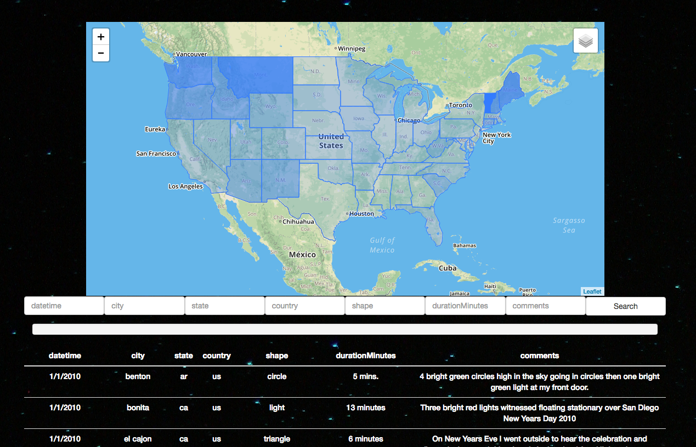

# 14-ste-Intro-to-Javascript
Filterable table to search for scraped UFO sighting data

## index.html
Builds table and search bar from data.   
Search built around 'contains' which works well for everything but date.
Works for any similarly formatted dataset.   

## index.1.html
Same as above but with Leaflet map showing Choropleth representations of the overall sightings per American state and sightings per capita per American state.

